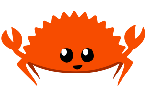
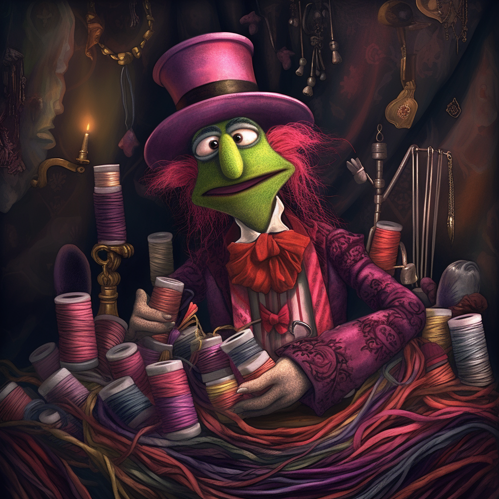
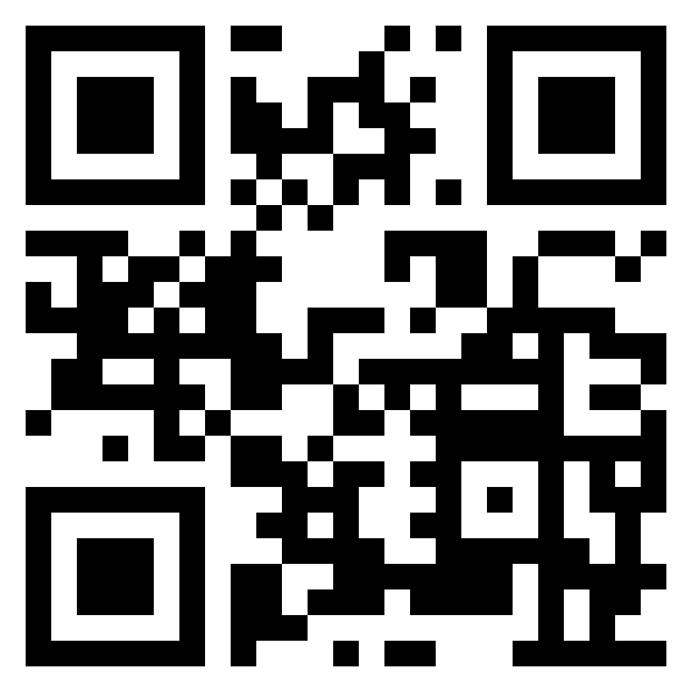

<!-- 
spreker: Rik
-->
# krab voor salamanders

## wat Topicanen moeten weten over Rust

---
<!-- 
spreker: Rik
-->
# wat is Rust?

* systeemtaal, vervanger C
* moderne taal: generics
* geen garbage collector
* niet objectgeoriënteerd
* procedureel met functionele invloeden
* multi platform (inclusief WASM en Arduino)
* zero cost abstractions

---
<!-- 
spreker: beide
-->
# wie zijn wij?

* Mart Kelder
* Rik Harink ([rik@har.ink](mailto:rik@har.ink))

---
<!-- 
spreker: Rik
-->
# de casus

## Graaf Tel is een beetje roestig

---
<!-- 
spreker: Mart
-->
# voorbeeld 1

---
<!--
spreker: Mart
-->
# verwijzingen

* verwijsbrief -> medisch dossier
* kopiëren verwijsbrief
* volgen verwijsbrief
* syntax
* exclusiviteit

---
<!-- 
spreker: Mart
-->
# borrow checker

* compile time memory safety
* 1 exclusieve instantie of meerdere gedeelde instanties
* eigenaarschap: wie is verantwoordelijk voor de data
* (undefined behaviour)

---
<!-- 
spreker: Rik
-->
# functionele eis

## modulo 3

---
<!-- 
spreker: Rik
-->

# functionele eis

## threading

---
<!-- 
spreker: Mart
-->
# structs

---
<!-- 
spreker: Rik
-->
# dus wat moeten Topicanen weten over Rust?

* Sterker getypeerd dan bijvoorbeeld C# / Java
* Mindset
* Bewust zijn van de kosten van oplossingen

---
<!-- 
spreker: Rik
-->
# linkdump

- <https://krab.toi.vet>
- <https://github.com/rikharink/topiconf-2023-rust-voor-topicanen>
- <https://rust-lang.org>
- <https://play.rust-lang.org>
- <https://rustup.rs>
- <https://fasterthanli.me>
