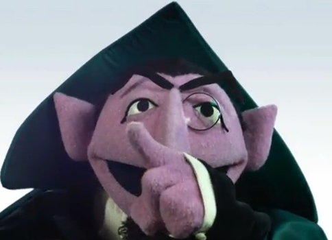
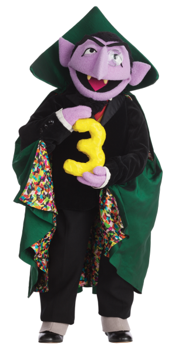
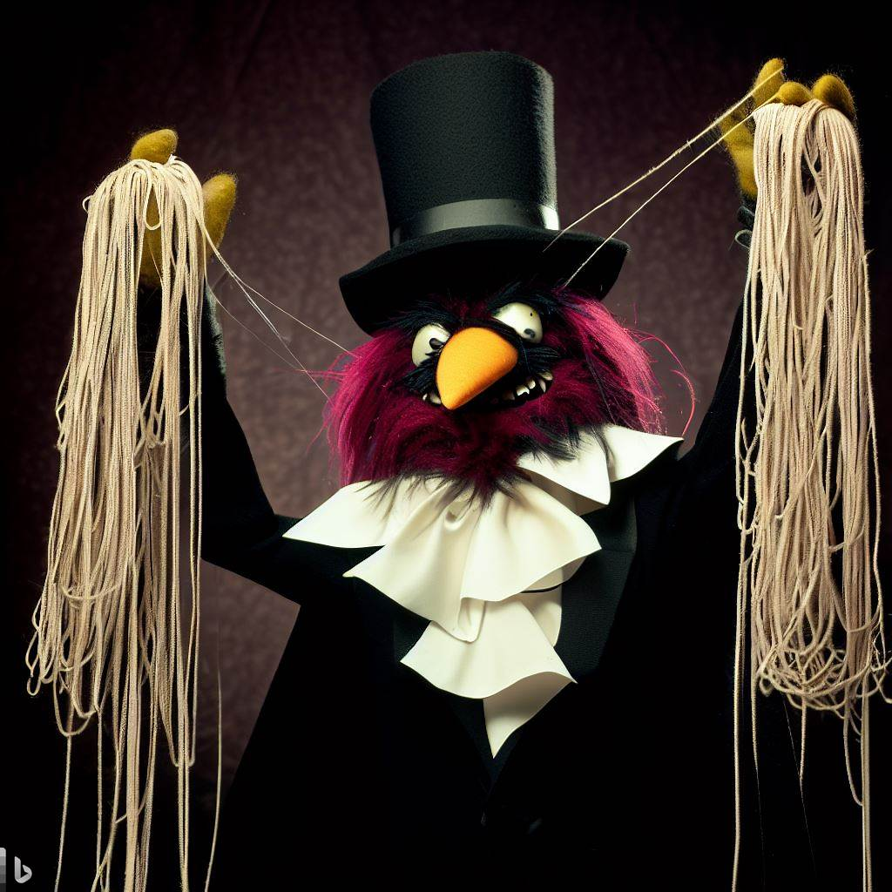

<!-- 
spreker: Rik
-->
# krab voor salamanders

## wat Topicanen moeten weten over Rust

---
<!-- 
spreker: Rik
-->
# wat is Rust?

* Systeemtaal, vervanger C
* Moderne taal: generics
* Geen Garbage Collector
* Niet objectgeorienteerd
* Multi platform (inclusief Wasm en Arduino)
* Procedureel met funcionele invloeden
* Zero cost abstractions

---
<!-- 
spreker: beide
-->
# wie zijn wij?

* Mart Kelder
* Rik Harink ([rik@har.ink](mailto:rik@har.ink))

---
<!-- 
spreker: Rik
-->
# de casus

## Graaf Tel is een beetje roestig

---
<!-- 
spreker: Mart
-->
# voorbeeld 1

---
<!-- 
spreker: Mart
-->
# borrow checker

* compile time memory safety
* 1 bewerkbare instantie of meerdere niet-bewerkbare instanties
* eigenaarschap: wie is verantwoordelijk voor de data
* (undefined behaviour)

---
<!-- 
spreker: Rik
-->
# functionele eis

## modulo 3

---
<!-- 
spreker: Rik
-->

# functionele eis

## threading

---
<!-- 
spreker: Mart
-->
# structs

---
<!-- 
spreker: Rik
-->
# dus wat moeten Topicanen weten over Rust?

* Sterker getypeerd dan bijvoorbeeld C# / Java
* Mindset
* Bewust zijn van de kosten van oplossingen

---
<!-- 
spreker: Rik
-->
# links

- <https://github.com/rikharink/topiconf-2023-rust-voor-topicanen>
- <https://rustup.rs/>
- <https://play.rust-lang.org/>
